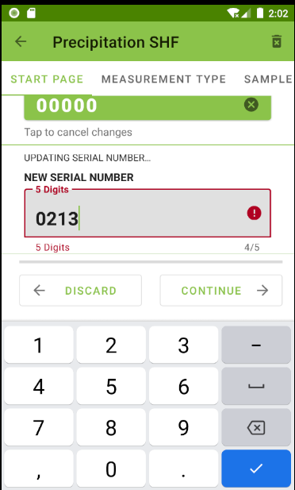

# SHF-Scientific-Data-Entry-Mobile-App
This is a data entry and management app built for environmental scientists to edit, analyze, and transmit information regarding research samples. 

## Technologies
Kotlin, Java, Android Studio, Android JetPack, Room Database, SQLite, SQL, XML, jQuery, Espresso, Groovy

## Demo

  

    
    
    
    
  

  

    
    
    
    
  

  

    
    
  

