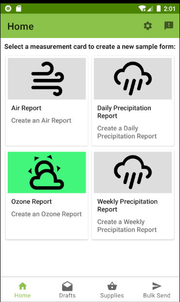
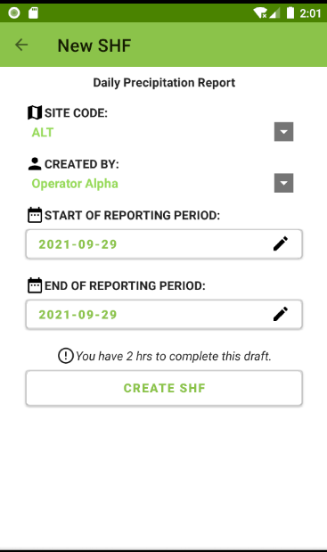
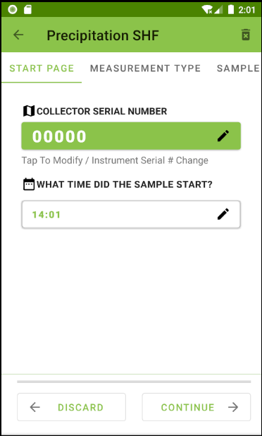
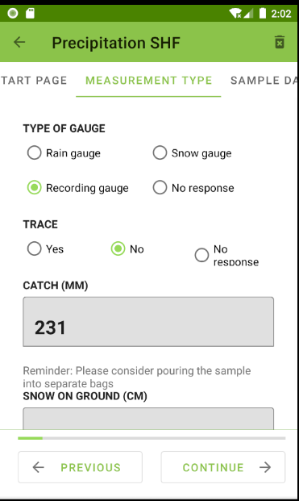
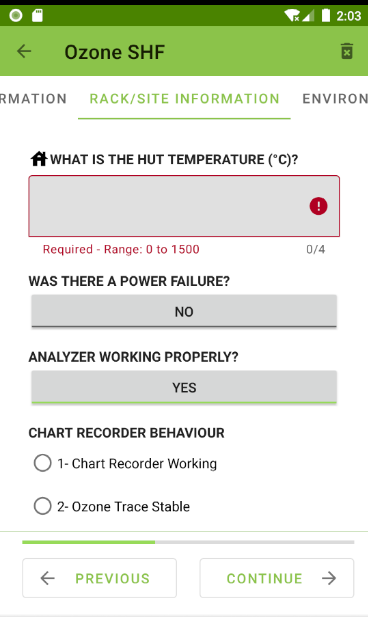
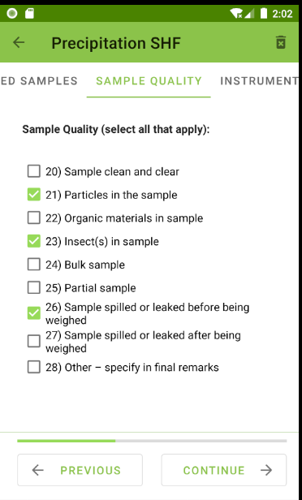
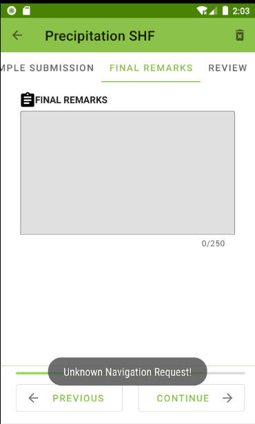
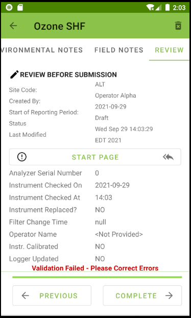
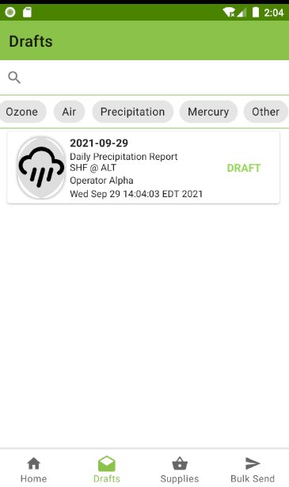
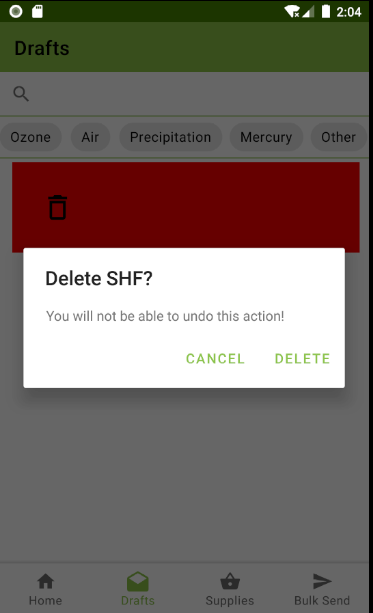

# SHF-Scientific-Data-Entry-Mobile-App
This is a data entry and management app built for environmental scientists to edit, analyze, and transmit information regarding research samples. 
Note: this repository demonstrates working features that can be shown to the public according to government guidelines, the code and some works are not included as their rights belong to Environment and Climate Change Canada.

## Technologies
Kotlin, Java, Android Studio, Android JetPack, Room Database, SQLite, SQL, XML, jQuery, Espresso, Groovy

## Use
On annual basis, an approximate equivalent of 4000 entries are filed and distributed throughout CAPMoN network. This app significantly reduces data entry errors, the time and effort required to load data into RDMQ (a data quality control system). The app is used to capture important data and metadata that are essential part of any analytical measurement system's QA/QC objectives in the CAPMoN labratories.

## Demo

  

    
    
    
    
  

  

    
    
    
    
  

  

    
    
  

## Commonly Used Design Patterns & Concepts
- MVVM (MVC)
- Single activity - Many fragments
- Binding properties (advanced observer pattern)
- Abstract factory
- Dependency injection
- Adapter
- Singleton
- Data migration
